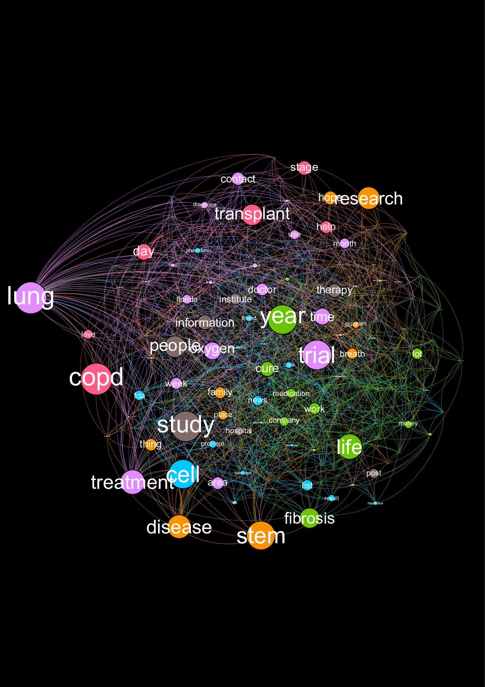
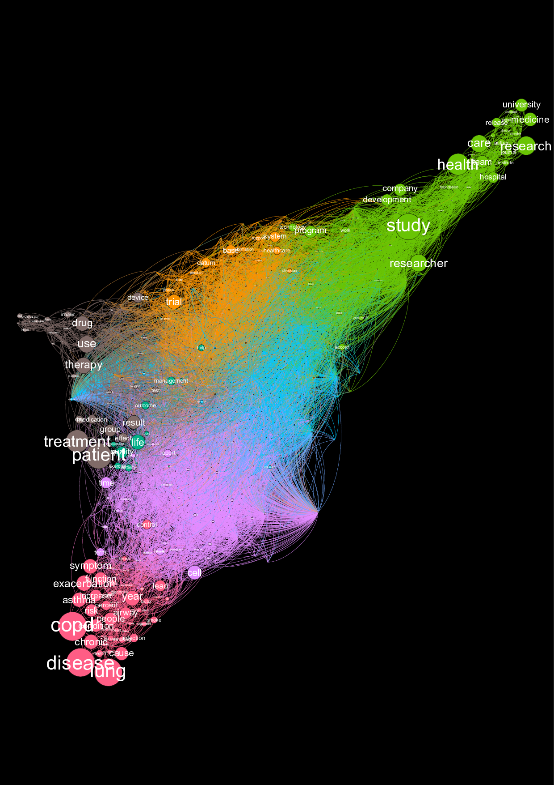

# data-science-literacy

In the OCPD project folder, is the work done on lung diseases. The source articles have been scrapped from www.lungdiseasenews.com.

The study focuses on the content of the articles and the reactions on the readers in the comments below each article.

Used NLP libraries word2vec and spacy to analyze corpuses.

Used networkx library to build the graphs.

Used gephi to study graphs draw graphical representations.

In the bellow representation, the size of a node is relative to the word frequency in the corpus. The edges link most similar words. Positions of the nodes are computed using the ForceAtlas 2 Algorithm. Nodes of the same color belongs to the same modularity class.

- for the article comments

- for the content of the articles

